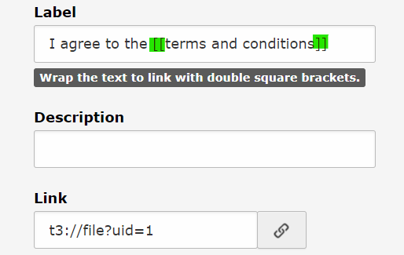

# form_typolink_checkbox

Typolink checkbox for TYPO3 form framework.

This extension adds a new checkbox element with the possibility to create a link within the label text.

## Integration

Just install the extension. No configuration or TypoScript setup required.

## Usage

1. Add the new element "Typolink Checkbox" to your form.
2. Wrap the text to link with double square brackets, otherwise the link is appendend to label text.

